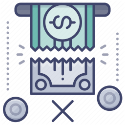

[![Contributors][contributors-shield]][contributors-url]
[![Forks][forks-shield]][forks-url]
[![Stargazers][stars-shield]][stars-url]
[![Issues][issues-shield]][issues-url]
[![MIT License][license-shield]][license-url] 
[![LinkedIn][linkedin-shield]][linkedin-url]


<!-- PROJECT LOGO -->
<br />
<p align="center">
  <a href="https://github.com/Aboalia/NRPM-Addon">
    
  </a>

  <h3 align="center">[Receivable - Payable Notes Management (RPN)] Add-on</h3>

  <p align="center">
    An Cheque or Notes Processing Add-On
    <br />
    <a href="https://github.com/Aboalia/NRPM-Addon"><strong>Explore the Project»</strong></a>
    <br />
    <br />
    <a href="https://github.com/Aboalia/NRPM-Addon">View Demo</a>
  </p>
</p>


<!-- TABLE OF CONTENTS -->
<details open="open">
  <summary>Table of Contents</summary>
  <ol>
    <li>
      <a href="#about-the-project">About The Project</a>
      <ul>
        <li><a href="#built-with">Built With</a></li>
      </ul>
    </li>
    <li>
      <a href="#getting-started">Here's why</a>
      <ul>
        <li><a href="#installation">Installation</a></li>
      </ul>
    </li>
    <li><a href="#contact">Contact</a></li>
  </ol>
</details>


<!-- ABOUT THE PROJECT -->
## About The Project
1. Here the Customer Balance.
[![Receiving Cheques][product-screenshot01]]()

2. Here the Customer Journal Entry.
[![Receiving Cheques][product-screenshot02]]()

3. Here the Customer is debit by adding a new invoice in its balance.
[![Receiving Cheques][product-screenshot03]]()

4. Here the Customer balance after adding A/R Invoice.
[![Receiving Cheques][product-screenshot04]]()

5. Here we will receive a new Cheques from Customer.
[![Receiving Cheques][product-screenshot05]]()

6. Here we will add a new Cheque with Details.
[![Receiving Cheques][product-screenshot06]]()

7. Here we will Deposit Cheque to Bank Treasury.
[![Receiving Cheques][product-screenshot07]]()

8. Here we will show the Company Treasury to send a Cheque to Bank Treasury.
[![Receiving Cheques][product-screenshot08]]()

9. After Specify the Bank and branch select a Cheque click "Sent to Bank >>" Button.
[![Receiving Cheques][product-screenshot09]]()

10. Now the Selected Cheque is Sented to Bank Treasury temporarily until you click on the "Add" Button.
[![Receiving Cheques][product-screenshot10]]()

11. Bank Treasury with the Cheque Added.
[![Receiving Cheques][product-screenshot11]]()

12. Here We will Reject the added Cheque if Customer blalnce is not cover Cheque Amount
[![Receiving Cheques][product-screenshot12]]()

[![Receiving Cheques][product-screenshot13]]()

[![Receiving Cheques][product-screenshot14]]()

[![Receiving Cheques][product-screenshot15]]()

[![Receiving Cheques][product-screenshot16]]()

[![Receiving Cheques][product-screenshot17]]()

[![Receiving Cheques][product-screenshot18]]()

[![Receiving Cheques][product-screenshot19]]()

[![Receiving Cheques][product-screenshot20]]()

[![Receiving Cheques][product-screenshot21]]()

[![Receiving Cheques][product-screenshot22]]()

[![Receiving Cheques][product-screenshot23]]()

[![Receiving Cheques][product-screenshot24]]()

[![Receiving Cheques][product-screenshot25]]()

[![Receiving Cheques][product-screenshot26]]()

[![Receiving Cheques][product-screenshot27]]()

[![Receiving Cheques][product-screenshot28]]()

[![Receiving Cheques][product-screenshot29]]()

[![Receiving Cheques][product-screenshot30]]()

[![Receiving Cheques][product-screenshot31]]()

[![Receiving Cheques][product-screenshot32]]()

[![Receiving Cheques][product-screenshot33]]()

[![Receiving Cheques][product-screenshot34]]()

[![Receiving Cheques][product-screenshot35]]()

[![Receiving Cheques][product-screenshot36]]()

[![Receiving Cheques][product-screenshot37]]()

[![Receiving Cheques][product-screenshot38]]()

[![Receiving Cheques][product-screenshot39]]()

[![Receiving Cheques][product-screenshot40]]()

[![Receiving Cheques][product-screenshot41]]()

[![Receiving Cheques][product-screenshot42]]()

[![Receiving Cheques][product-screenshot43]]()

[![Receiving Cheques][product-screenshot44]]()

[![Receiving Cheques][product-screenshot45]]()

### Built With

Add-ons/plugins Developed by:
* [SAP Business One SDK](https://www.sap.com/mena/products/business-one.html)
* [Microsoft C#](https://dotnet.microsoft.com/learn/csharp)
* [SQL Server](https://www.microsoft.com/en-us/sql-server/sql-server-2019)


<!-- GETTING STARTED -->
## Here`s Why
SAP Business One standard is not applicable with some customers and vendors they usually refuse to totally pay the Cheques and pay it in installment payments or cases of returning the Cheque from the bank due to insufficient balance so we develop an integrated [Receivable Cheques or Payable Cheques] Add-on to solve Partially Collected from the Customer And Partially Paid to Vendors issues.


### Installation
Get Os And Database type
1. Windows Server
 ```sh
   https://www.microsoft.com/en-us/evalcenter/evaluate-sql-server-2019?filetype=EXE
   ```
2. SQL Server
   ```sh
   https://www.microsoft.com/en-us/evalcenter/evaluate-sql-server-2019?filetype=EXE
   ```
OR version For HANA
1. Linux
    ```sh
   https://www.suse.com/download/sle-sap/
   ```
   
2. HANA DB
   ```sh
   https://launchpad.support.sap.com/#/softwarecenter
   ```
   
3. Get a SAP Business One Client at 
 ```sh
   https://www.sap.com/mena/products/business-one.html
   ```
4. Assgin Addon to Sld throw Extension Manager
   ```sh
   https://[Domain]:40000/ExtensionManager/
   ```


<!-- CONTACT -->
## Contact

Your Name - [LinkedIn]( https://www.linkedin.com/in/engabo3lia/) - Ahmed.Aboalia2015@gmail.com

Project Link: [Project Link](https://github.com/Aboalia/NRPM-Addon)


<!-- MARKDOWN LINKS & IMAGES -->
<!-- https://www.markdownguide.org/basic-syntax/#reference-style-links -->
[contributors-shield]: https://img.shields.io/github/contributors/othneildrew/Best-README-Template.svg?style=for-the-badge
[contributors-url]: https://github.com/Aboalia/NRPM-Addon/network/members
[forks-shield]: https://img.shields.io/github/forks/othneildrew/Best-README-Template.svg?style=for-the-badge
[forks-url]: https://github.com/Aboalia/NRPM-Addon/network/members
[stars-shield]: https://img.shields.io/github/stars/othneildrew/Best-README-Template.svg?style=for-the-badge
[stars-url]: https://github.com/Aboalia/NRPM-Addon/stargazers
[issues-shield]: https://img.shields.io/github/issues/othneildrew/Best-README-Template.svg?style=for-the-badge
[issues-url]: https://github.com/Aboalia/NRPM-Addon/issues
[license-shield]: https://img.shields.io/github/license/othneildrew/Best-README-Template.svg?style=for-the-badge
[license-url]: https://github.com/Aboalia/NRPM-Addon/blob/master/LICENSE.txt
[linkedin-shield]: https://img.shields.io/badge/-LinkedIn-black.svg?style=for-the-badge&logo=linkedin&colorB=555
[linkedin-url]: https://www.linkedin.com/in/engabo3lia/
[product-screenshot01]: Images/ScreenShot01.png
[product-screenshot02]: Images/ScreenShot02.png
[product-screenshot03]: Images/ScreenShot03.png
[product-screenshot04]: Images/ScreenShot04.png
[product-screenshot05]: Images/ScreenShot05.png
[product-screenshot06]: Images/ScreenShot06.png
[product-screenshot07]: Images/ScreenShot07.png
[product-screenshot08]: Images/ScreenShot08.png
[product-screenshot09]: Images/ScreenShot09.png
[product-screenshot10]: Images/ScreenShot10.png
[product-screenshot11]: Images/ScreenShot11.png
[product-screenshot12]: Images/ScreenShot12.png
[product-screenshot13]: Images/ScreenShot13.png
[product-screenshot14]: Images/ScreenShot14.png
[product-screenshot15]: Images/ScreenShot15.png
[product-screenshot16]: Images/ScreenShot16.png
[product-screenshot17]: Images/ScreenShot17.png
[product-screenshot18]: Images/ScreenShot18.png
[product-screenshot19]: Images/ScreenShot19.png
[product-screenshot20]: Images/ScreenShot20.png
[product-screenshot21]: Images/ScreenShot21.png
[product-screenshot22]: Images/ScreenShot22.png
[product-screenshot23]: Images/ScreenShot23.png
[product-screenshot24]: Images/ScreenShot24.png
[product-screenshot25]: Images/ScreenShot25.png
[product-screenshot26]: Images/ScreenShot26.png
[product-screenshot27]: Images/ScreenShot27.png
[product-screenshot28]: Images/ScreenShot28.png
[product-screenshot29]: Images/ScreenShot29.png
[product-screenshot30]: Images/ScreenShot30.png
[product-screenshot31]: Images/ScreenShot31.png
[product-screenshot32]: Images/ScreenShot32.png
[product-screenshot33]: Images/ScreenShot33.png
[product-screenshot34]: Images/ScreenShot34.png
[product-screenshot35]: Images/ScreenShot35.png
[product-screenshot36]: Images/ScreenShot36.png
[product-screenshot37]: Images/ScreenShot37.png
[product-screenshot38]: Images/ScreenShot38.png
[product-screenshot39]: Images/ScreenShot39.png
[product-screenshot40]: Images/ScreenShot40.png
[product-screenshot41]: Images/ScreenShot41.png
[product-screenshot42]: Images/ScreenShot42.png
[product-screenshot43]: Images/ScreenShot43.png
[product-screenshot44]: Images/ScreenShot44.png
[product-screenshot45]: Images/ScreenShot45.png


